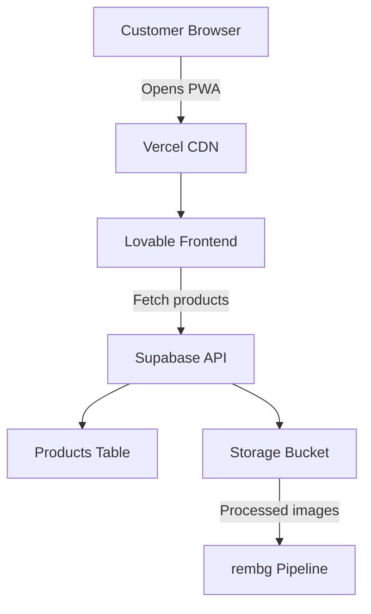

# PWA Architecture Overview

Digital Mannequin is built as a Progressive Web App — it runs in the browser but behaves like a native app.

## Architecture diagram

## Components

### Frontend — Lovable PWA
The customer-facing interface. Renders the mannequin and product catalogue. Communicates with Supabase via REST API.

### Backend — Supabase
Handles the database, authentication, and image storage. Provides auto-generated REST APIs for the products table.

### Image pipeline — rembg
Removes backgrounds from retailer-uploaded product images. Runs automatically on upload via a Supabase Edge Function.

### Hosting — Vercel
Serves the PWA globally via CDN. Auto-deploys on every push to the main branch.

## Data flow

1. Retailer uploads product image to Supabase Storage
2. Edge Function triggers rembg background removal
3. Processed image is saved back to Storage
4. Customer opens PWA — products load from Supabase
5. Customer selects items — mannequin updates in real time